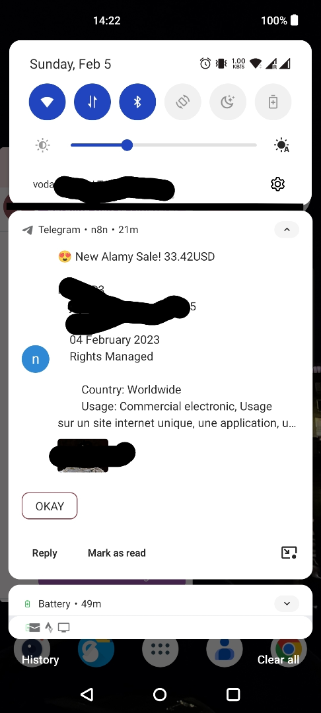
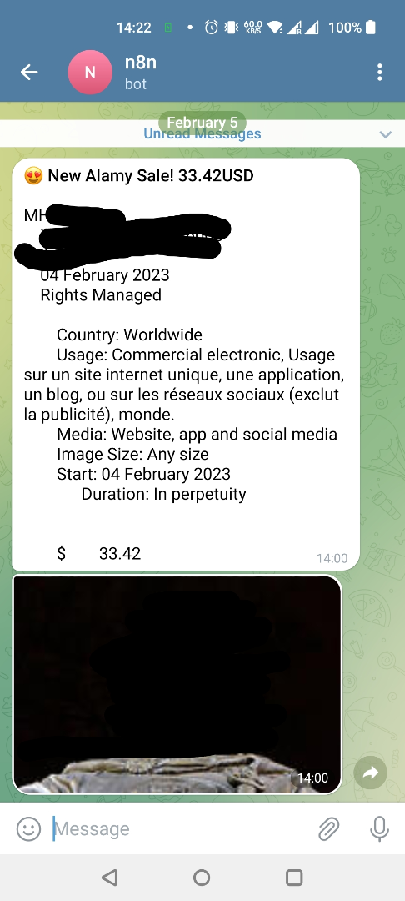
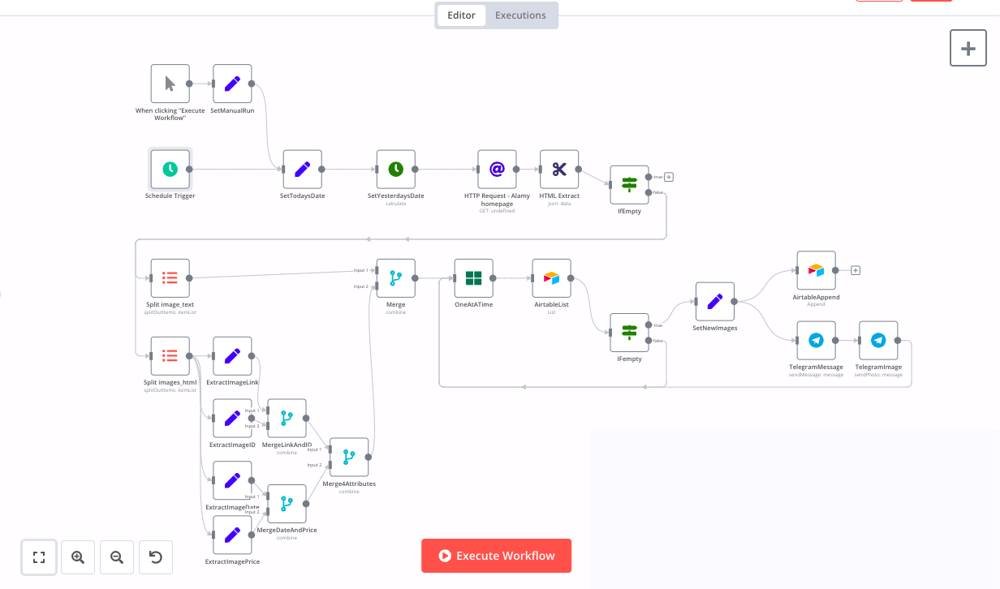

# MyAlamySales

MyAlamySales is an application based on a n8n workflow that sends notifications when a sale is made via the Alamy stock photography website.
Alamy doesn't have this feature. MyAlamySales enables the delight of getting notified of a new sale.  
  
  

## Table of contents
* [How it works](#how-it-works)
  * [Known limitations](#known-limitations)
* [Requirements](#requirements)
* [Setup](#setup)
* [Possible improvements](#possible-improvements)

## How it works

Alamy sales are reported in the contributor dashboard at `Reports.aspx`, the same day or a day later.

MyAlamySales is a workflow built with the automation platform [n8n](https://n8n.io/). At a pre-defined frequency, it will scrape the page `Reports.aspx` and look for sales made on the day or the day before. It will then extract from the sale row: image ID, sale date, sale price and thumbnail link.

MyAlamySales will look into Airtable for sales already notified, and if the sale is indeed new, it will send two messages on Telegram: one for the sales details and one with the image thumbnail. It will also insert a new row into the Airtable table with the timestamp of the notification.

### Known limitations
* Only handles properly Rights-Managed sales, doesn't parse Royalty-Free sales.
* Alamy doesn't identify the sales with a unique ID. Therefore, the triplet `{image ID, sale date, sale price}` is used to identify sales. It means that if the same image is sold twice at the same price and same date, only one notification will be sent. It can happen on Alamy, and is usually a duplicate purchase, one of which will be later refunded.
* Alamy's authentication mechanism is rather basic, and MyAlamySales scrapes the webpage using a cookie granted when using a web browser. It means that if this cookie is revoked, or if Alamy changes their authentication mechanism, introduces security checks, etc, MyAlamySales may stop working.
* This workflow having depencies on n8n, Telegram and Airtable, it may need adjustements if one of these services makes modifications to their authentication, data structure, etc. 

## Requirements

MyAlamySales is a n8n workflow, entirely contained in [`MyAlamySales.json`](./src/myalamysales.json). It requires the access to three services:
* a n8n platform, either [self-hosted (free)](https://docs.n8n.io/hosting/) or [as a service](https://n8n.io/pricing/)  
* a [Telegram bot](https://core.telegram.org/bots/api) (free) and a Telegram channel
* an [Airtable](https://airtable.com/) account (free tier available)
* and of course, an [Alamy contributor account](https://www.alamy.com/contributor/)

  
## Setup

The presonal data in the n8n workflow file has been redacted with `<ALAMYCOOKIE>`, `<TELEGRAMCREDENTIALS>`, `<TELEGRAMCHATID>`, `<AIRTABLELINK>`, `<AIRTABLECREDENTIALS>`. These steps are detailing how to replace them to make MyAlamySales work with your own accounts.

* With n8n, create a new workflow, and select "Import from file" from the hamburger menu. Select the JSON downloaded from [`MyAlamySales.json`](./src/myalamysales.json) 
* Copy your Alamy cookie
  * In Chrome Browser, open the Developer tools dashboard, using the [relevant shortcut](https://developer.chrome.com/docs/devtools/shortcuts/)
  while logged in as a contributor.
  * Open the contributor portal [My Alamy](https://www.alamy.com/myalamy-aim.aspx?login=1).
  * In the `Network` tab of the Developer tools, click the first request made to Alamy and display the `Headers`.
  * In the `Request Headers` section, copy the `cookie` field.
  * Paste this field in the `cookie` value of the `HTTP request` node, in place of the `<ALAMYCOOKIE>` placeholder.
* Link a Telegram bot
  * Follow tutorials, such as [this one](https://sendpulse.com/knowledge-base/chatbot/telegram/create-telegram-chatbot), to create a Telegram bot
  * Obtain the `Telegram bot token` and register it in the `Credentials` menu of n8n. Use it in the 2 Telegram nodes in place of the `<TELEGRAMCREDENTIALS>` placeholder.
  * Obtain the `chat ID`, by interacting with the bot and observing `https://api.telegram.org/bot<BOTToken>/getUpdates`. The `chat ID` is contained in the `id` key of the `chat` JSON object.
  * Enter the `chat id` in the 2 Telegram nodes, in place of the `<TELEGRAMCHATID>` placeholder. n8n will then send *from* the Telegram bot *to* the user or group represented by the `chat id`
* Obtain Airtable credentials
  * If needed, create a free account on Airtable.
  * Copy your [API key](https://airtable.com/account) and register it in the n8n Credentials menu. Use it in the 2 Airtable nodes in place of the `<AIRTABLECREDENTIALS>` placeholder.
  * Create a new base and a new table. Create 5 columns of the "Single line text" type, named: `image_id`, `image_date`, `image_price`, `image_link`, and `image_text`.
  * *(optional)* Add an extra column `Created time`, which is automatically set by Airtable when inserting the record, and may help you debug notifications. 
  * Copy the table URL, of the format `https://airtable.com/abc/def/ghj`, and paste it in the 2 fields `Base` and `Table` of the 2 Airtable nodes, in place of the `<AIRTABLELINK>` placeholder. with the option `By URL`.
* *(optional)* Change the dates of the Manual trigger that fits your test case
  * On the node `SetTodaysDate`, change the hard-coded date to a date where you have an Alamy Sale. This date is used when the n8n workflow is triggered manually, and will be picked up instead of the current date. It is useful to have an actual sale on that date to be able to test taht the workflow executes successfully. 
* *(optional)* Change scheduler interval
  * The node `Schedule trigger` is set to trigger every hour. You can change the schedule to make it run more or less frequently, or exclude some time windows.
* Toggle the workflow to `Active`

## Possible improvements

The current workflow can be improved with the following ideas. Reach out if you have a need or want to contribute!

* Send notification by email, alongside Telegram, or any other notification service (e.g. using AppRise) 
* Handle details of Royalty-free sales
* Handle refunded sales
* Implement a cleanup of the Airtable table used for not sending duplicate notifications. Airtable free plan covers 1200 rows, therefore 1200 sales, before needing a manual cleanup or an upgrade. 
* Add an Error workflow to notify when MyAlamySales fails to complete properly.
* Monitor the current settled balance and notify the payment amount (or the lack thereof)  
* If Alamy authentication concerns are lifted, create a webpage/website that lets users authenticate with their Alamy credentials, and automatically send notifications to their Alamy email. It would mean that no setup is required to receive Alamy sale notifications. 
